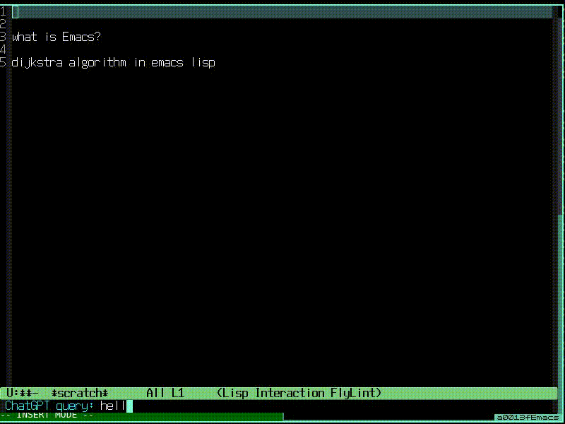

# NAME

**qutechat** - access ChatGTP from Emacs without OpenAI API



# NOTICE TO CHATGPT PLUS USERS

I have tested qutebrowser (version 2.5.4) and found that it does not
work with ChatGPT PLUS.  However, it works well with the free version
of ChatGPT.  If you are a ChatGPT PLUS user, you can use
**chatgpt-el** with the Chromium/Chrome browser instead.  As a ChatGPT
PLUS user myself, I no longer use **qutechat**.

# DESCRIPTION

**qutechat** is an Emacs Lisp program designed to interactively access
ChatGPT (https://chat.openai.com/) and other web-based chat systems
solely from within Emacs. While ChatGPT can be accessed via the OpenAI
API, this method has several drawbacks. 

1. Batch processing via OpenAI API is slow, making the experience of
   accessing ChatGPT frustrating.

2. Accessing ChatGPT via OpenAI API requires a non-free OpenAI account
   and credit card registration. Frequent access to ChatGPT can
   quickly become costly, requiring you to keep a close eye on your
   billing record.

**qutechat** solves these issues by accessing ChatGPT from Emacs
without an OpenAI API key. 

**qutechat** is implemented using the userscript feature of
qutebrowser (https://qutebrowser.org/) and therefore requires
qutebrowser to be running.  **qutechat** operates by remotely
controlling your instance of qutebrowser using the userscript called
`chat-proxy`.  Your qutebrowser must be able to execute this
userscript in order for **qutechat** to work.  Note that while
qutechat should work with any web-based chat system (or even any
webpage with an input form), it has only been tested with ChatGPT
(https://chat.openai.com/).

# INSTALLATION

``` sh
> git clone https://github.com/h-ohsaki/qutechat.git
> sudo install -m 644 qutechat/qutechat.el /usr/local/share/emacs/site-lisp
> git clone https://github.com/h-ohsaki/chatgpt-el.git
> sudo install -m 644 chatgpt-el/chatgpt.el /usr/local/share/emacs/site-lisp
> cat <<EOF >>~/.emacs
;; qutechat
(autoload 'chatgpt-query "qutechat" nil t)
(autoload 'chatgpt-insert-reply "qutechat" nil t)
(global-set-key "\C-cq" 'chatgpt-query)
(global-set-key "\C-cQ" 'chatgpt-insert-reply)
(setq qutechat-proxy-prog "../path/to/qutechat/chat-proxy")
EOF
```

# USAGE

1. Start a qutebrowser.

2. Visit ChatGPT (https://chat.openai.com/) in qutebrowser, and login
   with your OpenAI account.  Focus the input form field (i.e., `Send
   a messge...' field at the bottom of ChatGPT).

3. On Emacs, move the point (i.e., the cursor in Emacs) around the
   paragraph of the query.  Alternatively, you can select the region
   containing the query.  Then, type `C-c q` or execute `M-x
   chatgpt-query`.  With a prefix argument (e.g., `C-u C-c C-q`), you
   will be prompted what query prefix is prepended to the query.

4. The query is automatically submitted to ChatGPT in your
   qutebrowser.  The reply from ChatGPT will be displayed in another
   buffer in Emacs.

5. Once the reply is displayed, type `C-c Q` or execute M-x
   chatgpt-insert-reply from Emacs.  The reply from ChatGPT is
   inserted at the current point.

# TROUBLE SHOOTING

1. Make sure that you can control qutebrowser with `qutebrowser`
   command.
   
``` sh
> qutebrowser ':open -t lsnl.jp'
```

This command will open a new tab visiting `https://lsnl.jp' in
qutebrowser.

2. Perform steps 1 and 2 in USAGE.  Then, send a query from the
   command line using `chat-proxy` script.  Make sure the input form
   field is selected (i.e., focused) in qutebrowser.

``` sh
> echo hello >/tmp/test-query
> qutebrowser ':spawn -m -u ../path/to/chat-proxy -s /tmp/test-query'
```

You should see that "hello" is sent to ChatGPT in your qutebrowser.

3. Receive a reply from the command line using `chat-proxy` script.

``` sh
> ./chatgpt -r
> qutebrowser ':spawn -m -u ../path/to/chat-proxy -r /tmp/test-reply'
> cat /tmp/test-reply
hello

Hello! How can I assist you today?

EOF
```

This will show the reply from ChatGPT, which must be equivalent to
that shown in your Chromium/Chrome.

# PATCH TO QUTEBROWSER

On X Window System, qutebrowser automatillcay raises its window when a
command is executed remotely.  Due to this behavior, running
**qutechat** may lost the window focus from Emacs; the window focus
may or may not change from Emacs to qutebrowser.  To prevent this
annoying behavior, you can apply the following patch to qutebrowser.
You can find `mainwindow/mainwindow.py` in the qutebrowser
installation (e.g.,
`/usr/local/lib/python3.9/dist-packages/qutebrowser`).

``` python
--- mainwindow/mainwindow.py.orig       2023-04-17 03:42:04.348059533 +0900
+++ mainwindow/mainwindow.py    2023-04-17 03:45:50.230284419 +0900
@@ -80,7 +80,9 @@
         window.show()
         should_raise = True
 
-    if should_raise and not no_raise:
+    # Apr 17, 2023 by Hiroyuki Ohsaki        
+    # Completely disable raising window.
+    if False and should_raise and not no_raise:
         raise_window(window)
 
     return window.win_id
```
